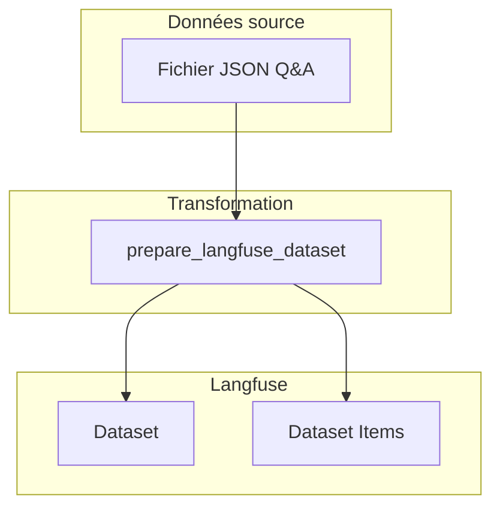
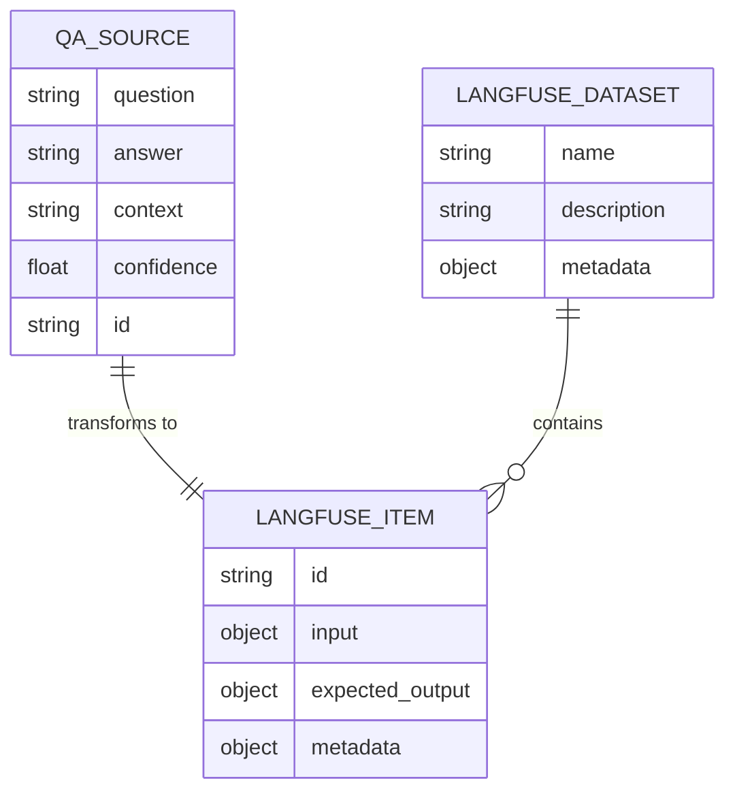
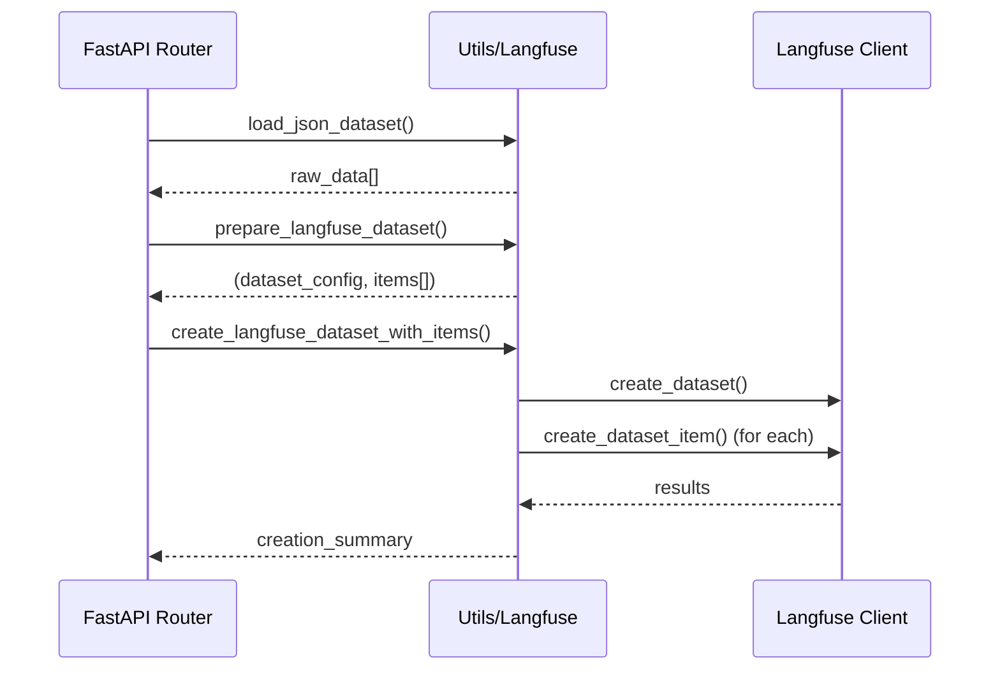

# Langfuse — Intégration et guide d'usage

Résumé
Langfuse est utilisé ici pour tracer et stocker des interactions modèles/utilisateurs et produire des datasets exportables pour annotation et analyse. Ce document décrit la configuration, cas d'utilisation pour l'export de datasets et les structures de données attendues pour les datasets et les items.

## 2. Configuration (variables d'environnement et options)
Variables d'environnement recommandées :
- LANGFUSE_API_KEY — clé privée.
- LANGFUSE_PROJECT_ID — identifiant du projet Langfuse.
- LANGFUSE_ENDPOINT — URL personnalisée de l'API (facultatif).

## 5. Structures de données

### General Architecture



### Modèle de données



### Flux de transformation



### 5.1 Objet Dataset (méta)
Champs recommandés :
- id (string) — identifiant unique.
- name (string) — nom lisible.
- description (string) — description.
- created_at (ISO timestamp)
- updated_at (ISO timestamp)
- tags (array[string]) — filtres/labels.
- item_count (integer)
- schema_version (string) — version du schéma des items.
- metadata (object) — libre pour infos custom.

Exemple JSON :
```json
{
  "id": "ds_123",
  "name": "support-conversations-2025",
  "description": "Conversations clientes pour annotation intent/response",
  "created_at": "2025-08-01T12:34:56Z",
  "tags": ["support", "english"],
  "item_count": 12456,
  "schema_version": "v1",
  "metadata": {"source":"prod-stream-1"}
}
```

### 5.2 Objet Item (entrée d'un dataset)
Champs recommandés (version commune) :
- item_id (string) — identifiant unique.
- dataset_id (string)
- type (string) — "text" | "image" | "audio" | "multimodal"
- content (object) — payload dépendant du type.
- labels (array/object) — annotations (facultatif).
- status (string) — "new" | "in_review" | "validated"
- created_at, updated_at (timestamps)
- metadata (object) — clés additionnelles (user_id, session_id, source)

Exemples concrets :

Text item
```json
{
  "item_id": "itm_0001",
  "dataset_id": "ds_123",
  "type": "text",
  "content": {
    "text": "Bonjour, j'ai un problème avec ma commande #1234",
    "language": "fr"
  },
  "labels": [{"label":"intent", "value":"order_issue"}],
  "status": "new",
  "created_at": "2025-08-02T09:00:00Z",
  "metadata": {"user_id":"u_789"}
}
```

Image item (référence externe pour assets)
```json
{
  "item_id": "itm_img_01",
  "type": "image",
  "content": {
    "url": "https://cdn.example.com/images/abc.jpg",
    "width": 1024,
    "height": 768
  },
  "labels": [{"label":"defect","value":true}],
  "status": "in_review"
}
```

Audio item
```json
{
  "item_id": "itm_audio_01",
  "type": "audio",
  "content": {
    "url": "https://cdn.example.com/audio/rec_01.wav",
    "duration_seconds": 12.4,
    "transcript": "Bonjour..."
  }
}
```

Multimodal item (texte + image)
```json
{
  "item_id": "itm_mm_01",
  "type": "multimodal",
  "content": {
    "text": "Voici la photo du produit.",
    "images": [{"url":"https://.../1.jpg"}, {"url":"https://.../2.jpg"}]
  }
}
```

### 5.3 Schéma JSON minimal (exemple)
```json
{
  "type": "object",
  "required": ["item_id","type","content"],
  "properties": {
    "item_id": {"type":"string"},
    "type": {"type":"string"},
    "content": {"type":"object"},
    "labels": {"type":["array","null"]},
    "status": {"type":"string"},
    "metadata": {"type":"object"}
  }
}
```

## 6. Bonnes pratiques
- Utiliser des IDs stables et lisibles (préfixes ds_/itm_).
- Garder la "content" extensible mais documentée par schema_version.
- Ajouter un champ schema_version dans le dataset pour gérer évolutions.
- Préserver l'asset original (URL + checksum) et référencer localement si besoin.

## 7. Validation et contrôle qualité
- Valider JSONL via un schéma JSON avant import/annotation.
- Vérifier l'existence et l'accessibilité des URLs d'assets.
- Contrôler doublons via item_id.

## 8. Versioning des datasets
- Chaque export peut inclure metadata.version (ex: "v2025-08-01").
- Garder historique des exports et appliquer tags (dry-run, validated, gold).

