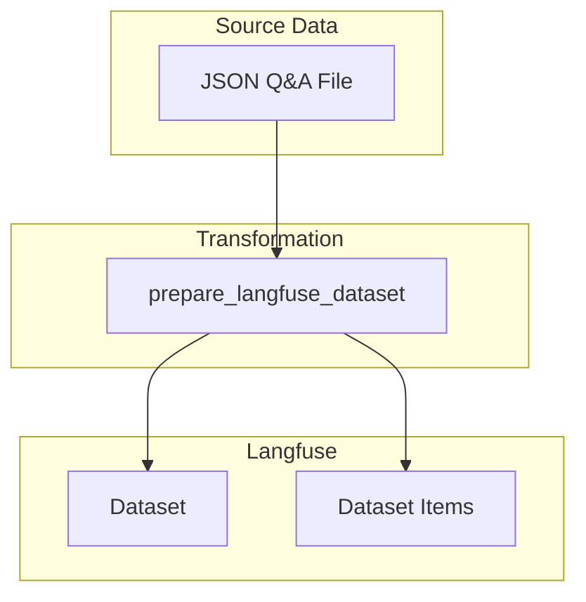
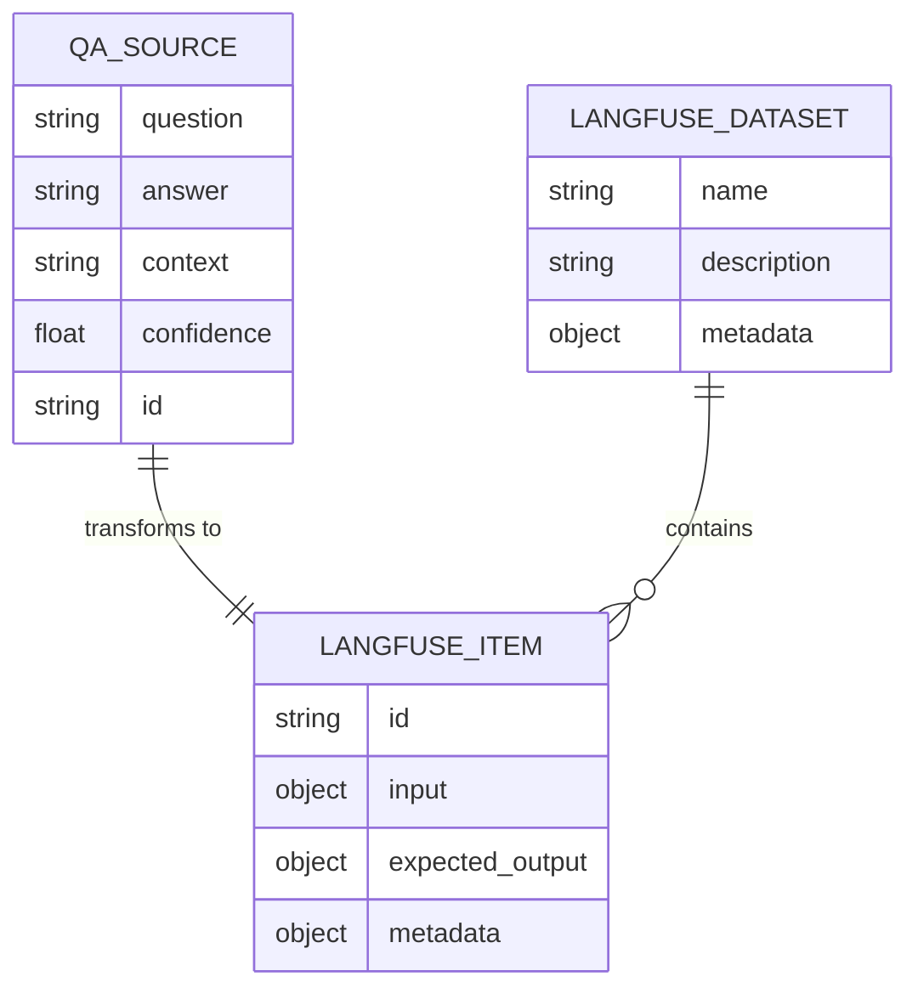
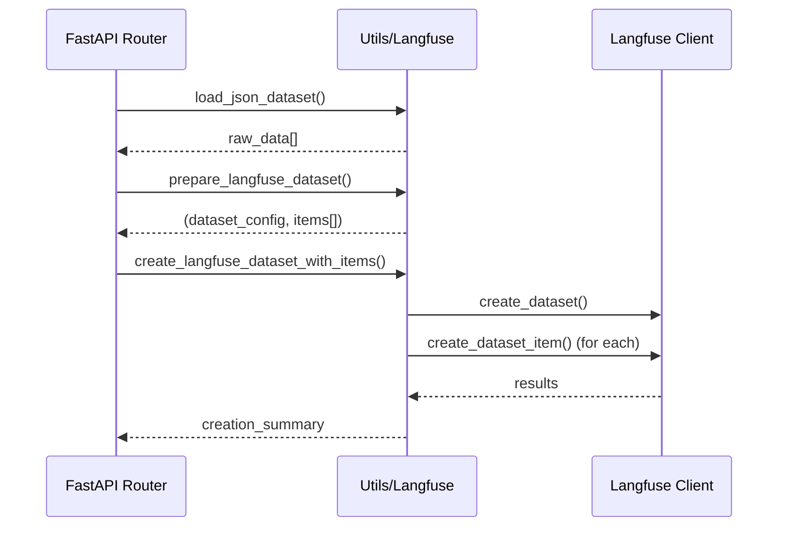

# Langfuse — Integration and Usage Guide

Summary
Langfuse is used here to trace and store model/user interactions and produce exportable datasets for annotation and analysis. This document describes the configuration, use cases for dataset export, and expected data structures for datasets and items.

## 2. Configuration (environment variables and options)
Recommended environment variables:
- LANGFUSE_API_KEY — private key.
- LANGFUSE_PROJECT_ID — Langfuse project identifier.
- LANGFUSE_ENDPOINT — custom API URL (optional).

## 5. Data structures

### General Architecture



### Data Model



### Transformation Flow



### 5.1 Dataset Object (metadata)
Recommended fields:
- id (string) — unique identifier.
- name (string) — readable name.
- description (string) — description.
- created_at (ISO timestamp)
- updated_at (ISO timestamp)
- tags (array[string]) — filters/labels.
- item_count (integer)
- schema_version (string) — version of the items schema.
- metadata (object) — free for custom info.

JSON example:
```json
{
  "id": "ds_123",
  "name": "support-conversations-2025",
  "description": "Customer conversations for intent/response annotation",
  "created_at": "2025-08-01T12:34:56Z",
  "tags": ["support", "english"],
  "item_count": 12456,
  "schema_version": "v1",
  "metadata": {"source":"prod-stream-1"}
}
```

### 5.2 Item Object (dataset entry)
Recommended fields (common version):
- item_id (string) — unique identifier.
- dataset_id (string)
- type (string) — "text" | "image" | "audio" | "multimodal"
- content (object) — type-dependent payload.
- labels (array/object) — annotations (optional).
- status (string) — "new" | "in_review" | "validated"
- created_at, updated_at (timestamps)
- metadata (object) — additional keys (user_id, session_id, source)

Concrete examples:

Text item
```json
{
  "item_id": "itm_0001",
  "dataset_id": "ds_123",
  "type": "text",
  "content": {
    "text": "Hello, I have a problem with my order #1234",
    "language": "en"
  },
  "labels": [{"label":"intent", "value":"order_issue"}],
  "status": "new",
  "created_at": "2025-08-02T09:00:00Z",
  "metadata": {"user_id":"u_789"}
}
```

Image item (external reference for assets)
```json
{
  "item_id": "itm_img_01",
  "type": "image",
  "content": {
    "url": "https://cdn.example.com/images/abc.jpg",
    "width": 1024,
    "height": 768
  },
  "labels": [{"label":"defect","value":true}],
  "status": "in_review"
}
```

Audio item
```json
{
  "item_id": "itm_audio_01",
  "type": "audio",
  "content": {
    "url": "https://cdn.example.com/audio/rec_01.wav",
    "duration_seconds": 12.4,
    "transcript": "Hello..."
  }
}
```

Multimodal item (text + image)
```json
{
  "item_id": "itm_mm_01",
  "type": "multimodal",
  "content": {
    "text": "Here is the product photo.",
    "images": [{"url":"https://.../1.jpg"}, {"url":"https://.../2.jpg"}]
  }
}
```

### 5.3 Minimal JSON Schema (example)
```json
{
  "type": "object",
  "required": ["item_id","type","content"],
  "properties": {
    "item_id": {"type":"string"},
    "type": {"type":"string"},
    "content": {"type":"object"},
    "labels": {"type":["array","null"]},
    "status": {"type":"string"},
    "metadata": {"type":"object"}
  }
}
```

## 6. Best practices
- Use stable and readable IDs (prefixes ds_/itm_).
- Keep "content" extensible but documented by schema_version.
- Add a schema_version field in the dataset to manage evolutions.
- Preserve the original asset (URL + checksum) and reference locally if needed.

## 7. Validation and quality control
- Validate JSONL via a JSON schema before import/annotation.
- Check existence and accessibility of asset URLs.
- Control duplicates via item_id.

## 8. Dataset versioning
- Each export can include metadata.version (ex: "v2025-08-01").
- Keep history of exports and apply tags (dry-run, validated, gold).

